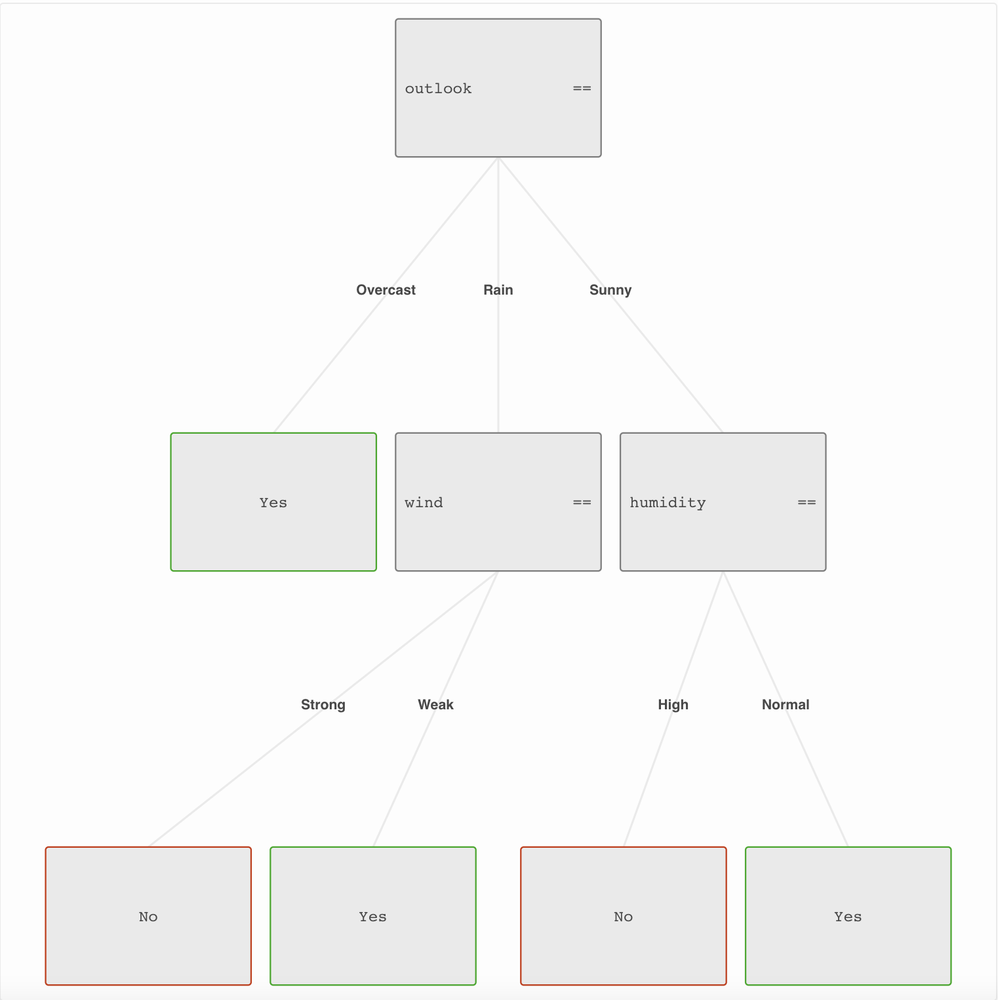

# Let`s jump on it...


## Installation

first, we will need to install **tree-garden**

`npm i tree-garden` 

should do the trick - as long as you are not using **yarn** :laughing:

tree-garden has **no dependencies** an **no peer-dependencies**, which should help with maintenance, security
and bundle size - feel free to check on [bundlephobia &#x1F609;](https://bundlephobia.com/package/tree-garden@latest) 

## Simple prediction model
** Do you like tennis?**
> Well, I don`t like tennis, but i have tennis data set!

if we want to do  some fancy machine learning, we need a couple of things:

- [ ] Some data from past - data set
- [ ] Some algorithm or way how we turn this data set into predictive model
- [ ] Also, some samples that we want to predict using our new model!
---

- [x]  As data set we have simple data set, with records if we go to play tennis dependent on weather.
It should look like:

| Outlook| Temperature| Humidity|Wind|Did I play tennis?|
| :---: | :---: |:---: |:---: |:---: |
|Sunny|Hot|Hight|Weak|No|
|Overcast|Hot|Hight|Weak|Yes|
|Rain|Cool|Normal|Strong|No|
|...|...|...|...|...|

You can see whole data set [here](https://github.com/miob-miob/treeGarden/blob/master/src/sampleDataSets/tennis.ts#L2) 

- [x] Algorithm will be default tree-garden configuration 
- [x] Sample for testing will be current weather: 
```javascript
const sample = {
  outlook: 'Rain', temp: 'Mild', humidity: 'Normal', wind: 'Weak'
}
```

### Code 

[code_file](docs/code_snippets/shouldIPlayTenis.ts)

### Comments
!!! important "Tags in comments of presented code"
    You can notice in comments of code, I let some tags like **`[configuration]`** and
    **`[sample]`** [see here](https://github.com/miob-miob/treeGarden/blob/master/docs/code_snippets/shouldIPlayTenis.ts#L30) .
    These tags mean I want to break it down further in comments in docs.
    I will do so on multiple places of tree-garden docs.

**[configuration]**  
[See page](importantBasics.md#configuration) which describes configuration in detail
  
**[data set]**  
[See data set ](importantBasics.md#data-set) for more information.

**[tree]**  
More information on trained tree can be found [here.](importantBasics.md#decision-tree)

**[sample]**  
Sample that we want to classify is based on weather in time of writing.
> Joking it is night, and I have no clue what weather is...  :material-weather-night:

Samples in data set and sample which You are trying to predict does not have to be complete 
(they can have missing fields). Check how to [deal with missing values](importantBasics.md#dealing-with-missing-values).

**[result]**  
Result of our decision tree which is presented with our sample is either **`'Yes'`** or 
**`'No'`** - classes found in our training data set. See api docs for [getTreePrediction](api/modules.md#gettreeprediction)
function.  
If you want for instance whole node, where your sample landed, check functions in 
[predict namespace](api/modules/predict.md).


**[output for visualization tool]**  
You can open [visualization tool here on **codesandbox**](https://codesandbox.io/s/nostalgic-water-eozhj6) or [full screen](https://eozhj6.csb.app/), 
copy output of `JSON.stringify(tree)` and paste it into *Trained tree* text box and push *Load tree* button.  
If you scroll down you should be able to see your first trained tree!  
Congratulation! &#128521


### Tree visualization

I used [tree garden visualization](https://github.com/miob-miob/treeGardenVisualization) to 
produce image of my trained tree 





[comment]: <> (TODO )
## Bit more advanced example
Todo!!!
### Code
### Comments 
### Visualization
