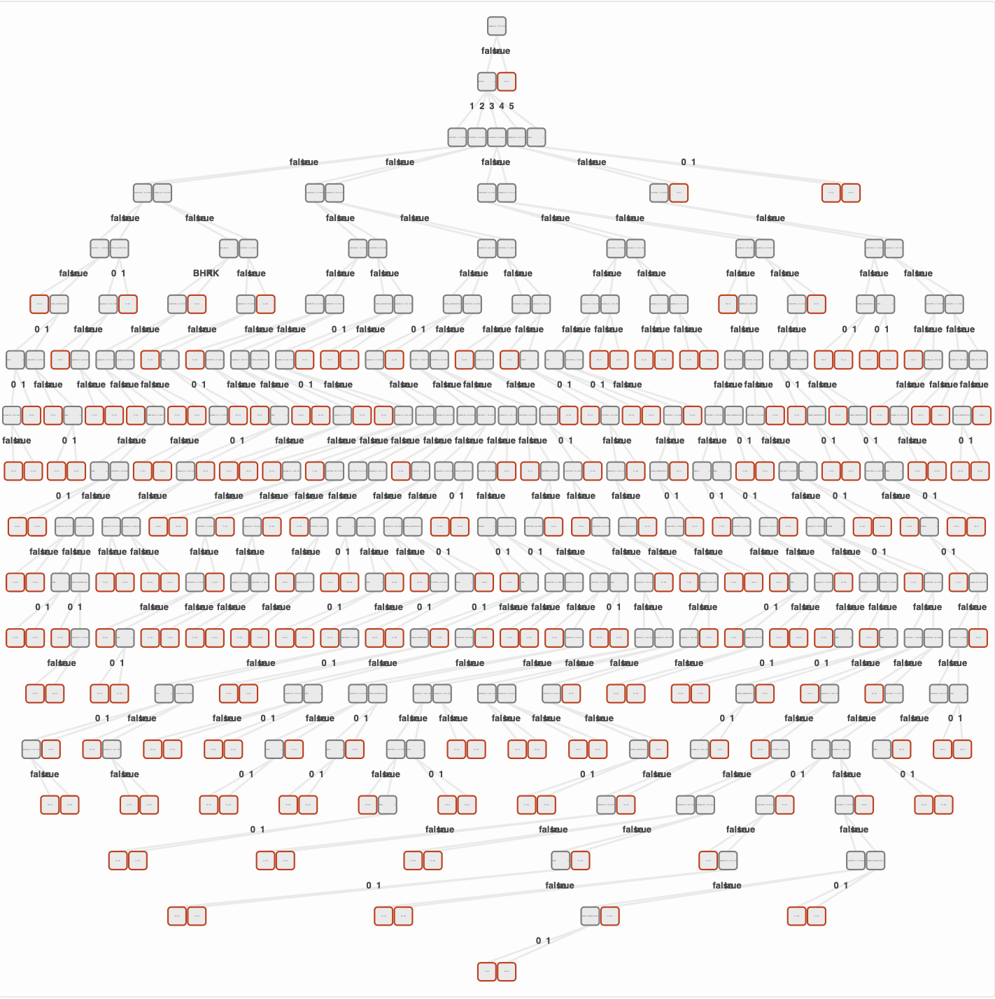

# Let`s jump on it...


## Installation

first, we will need to install **tree-garden**

`npm i tree-garden` 

should do the trick - as long as you are not using **yarn** :laughing:

tree-garden has **no dependencies** an **no peer-dependencies**, which should help with maintenance, security
and bundle size - feel free to check on [bundlephobia &#x1F609;](https://bundlephobia.com/package/tree-garden@latest) 

## Simple prediction model
** Do you like tennis?**
> Well, I don`t like tennis, but i have tennis data set!

if we want to do  some fancy machine learning, we need a couple of things:

- [ ] Some data from past - data set
- [ ] Some algorithm or way how we turn this data set into predictive model
- [ ] Also, some samples that we want to predict using our new model!
---

- [x]  As data set we have simple data set, with records if we go to play tennis dependent on weather.
It should look like:

| Outlook| Temperature| Humidity|Wind|Did I play tennis?|
| :---: | :---: |:---: |:---: |:---: |
|Sunny|Hot|Hight|Weak|No|
|Overcast|Hot|Hight|Weak|Yes|
|Rain|Cool|Normal|Strong|No|
|...|...|...|...|...|

You can see whole data set [here](https://github.com/miob-miob/treeGarden/blob/master/src/sampleDataSets/tennis.ts#L2) 

- [x] Algorithm will be default tree-garden configuration 
- [x] Sample for testing will be current weather: 
```javascript
const sample = {
  outlook: 'Rain', temp: 'Mild', humidity: 'Normal', wind: 'Weak'
}
```

### Code 

[code_file](docs/code_snippets/shouldIPlayTenis.ts)

### Comments
!!! important "Tags in comments of presented code"
    You can notice in comments of code, I let some tags like **`[configuration]`** and
    **`[sample]`** [see here](https://github.com/miob-miob/treeGarden/blob/master/docs/code_snippets/shouldIPlayTenis.ts#L30) .
    These tags mean I want to break it down further in comments in docs.
    I will do so on multiple places of tree-garden docs.

**[configuration]**  
[See page](importantBasics.md#configuration) which describes configuration in detail
  
**[data set]**  
[See data set ](importantBasics.md#data-set) for more information.

**[tree]**  
More information on trained tree can be found [here.](importantBasics.md#decision-tree)

**[sample]**  
Sample that we want to classify is based on weather in time of writing.
> Joking it is night, and I have no clue what weather is...  :material-weather-night:

Samples in data set and sample which You are trying to predict does not have to be complete 
(they can have missing fields). Check how to [deal with missing values](importantBasics.md#dealing-with-missing-values).

**[result]**  
Result of our decision tree which is presented with our sample is either **`'Yes'`** or 
**`'No'`** - classes found in our training data set. See api docs for [getTreePrediction](api/modules.md#gettreeprediction)
function.  
If you want for instance whole node, where your sample landed, check functions in 
[predict namespace](api/modules/predict.md).


**[output for visualization tool]**  
You can open [visualization tool here on **codesandbox**](https://codesandbox.io/s/nostalgic-water-eozhj6) or [full screen](https://eozhj6.csb.app/), 
copy output of `JSON.stringify(tree)` and paste it into *Trained tree* text box and push *Load tree* button.  
If you scroll down you should be able to see your first trained tree!  
Congratulation! &#128521


### Tree visualization

I used [tree garden visualization](https://github.com/miob-miob/treeGardenVisualization) to 
produce image of my trained tree 


## Bit more advanced example

We will now let grow regression tree (tree will predict value not class), that will be able to predict price of houses in
some Indian city, where data come from...  
We will need to make some tweaks in configuration to run **regression** tree - default is **classification**.  

**`housePrices`** data set is also packed with tree-garden, let`s see how it looks like:
```json
[
{"POSTED_BY": "Owner", "UNDER_CONSTRUCTION": "0", "RERA": "0", "BHK_NO.": "2", "BHK_OR_RK": "BHK", "SQUARE_FT": "1300.236407", "READY_TO_MOVE": "1", "RESALE": "1", "ADDRESS": "Ksfc Layout,Bangalore", "LONGITUDE": "12.96991", "LATITUDE": "77.59796", "_class": 55.0},
{"POSTED_BY": "Dealer", "UNDER_CONSTRUCTION": "0", "RERA": "0", "BHK_NO.": "2", "BHK_OR_RK": "BHK", "SQUARE_FT": "1275.0", "READY_TO_MOVE": "1", "RESALE": "1", "ADDRESS": "Vishweshwara Nagar,Mysore", "LONGITUDE": "12.274538", "LATITUDE": "76.644605", "_class": 51.0},
{"POSTED_BY": "Owner", "UNDER_CONSTRUCTION": "0", "RERA": "0", "BHK_NO.": "2", "BHK_OR_RK": "BHK", "SQUARE_FT": "933.1597222000001", "READY_TO_MOVE": "1", "RESALE": "1", "ADDRESS": "Jigani,Bangalore", "LONGITUDE": "12.778033", "LATITUDE": "77.632191", "_class": 43.0}
]
```

You can see, every field except **`_class`** is string. This is not ideal as `LATITUDE`, `LONGITUDE` and `SQUARE_FT` are clearly 
numbers. We will have to tackle it in configuration as well.

### Code
[code_file](docs/code_snippets/regressionTree.ts)


### Comments 

**[split scoring function]**  
For regression trees we must set other impurity measuring function than **information gain ratio**. Check 
[api doc of getScoreForRegressionTreeSplit](./api/modules/impurity.md#getscoreforregressiontreesplit) 
which in a nutshell calculates sum of distances from average value of given tag of samples. For more detailed 
information check code or tests of `getScoreForRegressionTreeSplit`.
!!! important "Smaller value better split!"
    Entropy based functions reduce entropy in dataset after split - **bigger** reduction better split.  
    In case of regression tree -  **smaller sum of residuals** better split.

**[force data type]**  
If there is the field in data set which type is `string` (`'discrete'`), but You see, it can be safely casted 
to `number` (`'continuous'`), You can do so by manually hinting type for given attribute in configuration.
[buildAlgorithmConfiguration](./api/modules.md#buildalgorithmconfiguration) function will try 
to parse given field as `number`, if it meets some problematic value (except missing one), it will throw error.  
You can also cast attributes in opposite way - force `'continuous'` values to behave as 
`'discrete'`.

**[un-pruned tree]**  
If you let grow tree without any limitations, it will usually produce giant tree which is over-fitted towards 
training data set.  
Such trees have unpleasant properties:  

- hard to interpret 
- slow, because they are deep
- over-fitted (low accuracy on data they did not see during training)

In our case tree has several hundreds of nodes and accuracy on validation data set is not good:



**[regression tree accuracy]**  
Accuracy is measured differently in case of regression trees. It is similar like [R coefficient of linear regression](https://en.wikipedia.org/wiki/Coefficient_of_determination), 
but absolute value is used instead of squared one. It is always number up to 1, closer to 1 means
better accuracy. For more information check implementation of [getRAbsError](./api/modules/statistics.md#getrabserror).


### Tree visualization
